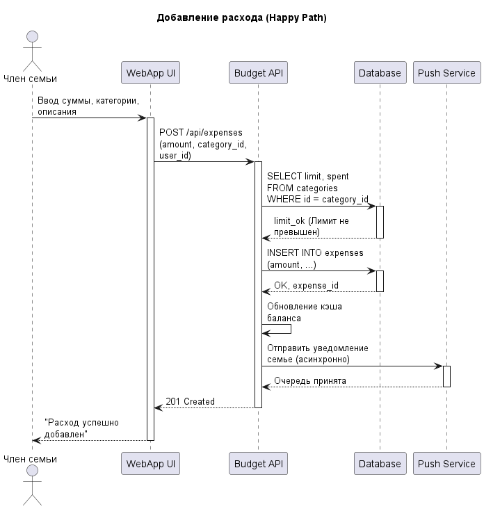
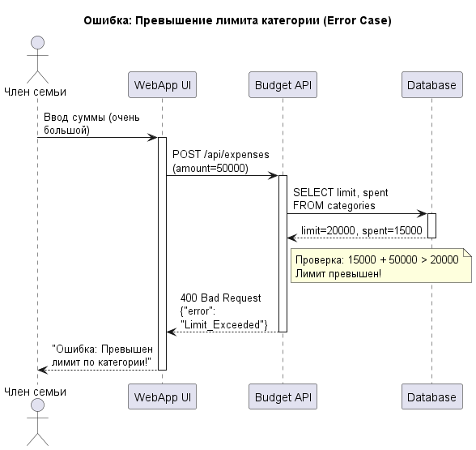

Министерство образования Республики Беларусь

Учреждение образования

"Брестский Государственный технический университет"

Кафедра ИИТ

      

<strong>Лабораторная работа №1</strong>

<strong>По дисциплине:</strong> "Проектирование интернет-систем"

<strong>Тема:</strong> "Сценарий транзакции: моделирование use-case и границ ответственности"

      

<strong>Выполнил:</strong>

Студент 3 курса

Группы ПО-13

Петручик Е.Н.

<strong>Проверил:</strong>

Несюк А.Н.

     

<strong>Брест 2026</strong>

---

## Цель работы

Научиться анализировать бизнес-процессы интернет-системы, выявлять границы ответственности компонентов и моделировать транзакционные сценарии с учётом возможных сбоев.

---

## Вариант №49 - Планировщик бюджета семьи «Про рубли» 💵

**Питч:** Все траты видны, ссоры в семье меньше.

**Ядро домена:** Члены семьи, Категории, Операции (доходы/расходы), Лимиты, Отчёты, Совместные расходы.

---

## Ход выполнения работы

### 1. Структура проекта

*Так как работа выполняется локально по согласованию с преподавателем, ниже представлена структура рабочей директории:*

* `Отчет.md` — Основной отчёт (этот документ)
* `use-case.md` — Текстовое описание use-case
* `scenarios.feature` — Gherkin-сценарии
* `analysis.md` — Анализ границ ответственности
* `diagrams/` — Папка с диаграммами
  * `sequence-happy.puml` — Код PlantUML (успешный сценарий)
  * `sequence-happy.png` — Экспорт успешной диаграммы
  * `sequence-error-payment.puml` — Код PlantUML (сценарий ошибки)
  * `sequence-error-payment.png` — Экспорт диаграммы с ошибкой

---

### 2. Use-case описание

👉 **Ссылка на файл:** [use-case.md](use-case.md)

**Основной сценарий:** Добавление совместного расхода в семейный бюджет с проверкой лимита.

**Первичный актор:** Член семьи (Пользователь).

**Цель:** Добавить новую трату (расход) в систему, чтобы она отобразилась в общем бюджете, и уведомить остальных членов семьи.

**Краткое описание основного потока:**
1. Пользователь вводит сумму, категорию и нажимает "Сохранить".
2. Система проверяет лимит категории.
3. Система сохраняет транзакцию в БД.
4. Система обновляет общий баланс.
5. Система асинхронно рассылает Push-уведомления остальным членам семьи.

**Альтернативные потоки:**
* Отсутствие указанной категории (присвоение "Разное").

**Исключительные ситуации:**
* Превышение лимита.
* Падение БД.
* Недоступность сервиса уведомлений.

---

### 3. Диаграммы последовательности (Sequence Diagrams)

#### Happy Path (успешный сценарий)

👉 **PlantUML исходник:** [sequence-happy.puml](diagrams/sequence-happy.puml)

**Описание потока:**
Пользователь отправляет данные через UI. API проверяет лимиты в БД, записывает расход и асинхронно передает задачу сервису Push-уведомлений, сразу отдавая пользователю ответ "Успех".

**Участники:**
* Член семьи (Актор)
* WebApp UI (Frontend)
* Budget API (Backend)
* Database (PostgreSQL)
* Push Service (Внешний сервис)

---

#### Error Case: превышение лимита или ошибка оплаты

👉 **PlantUML исходник:** [sequence-error-payment.puml](diagrams/sequence-error-payment.puml)

**Описание потока:**
Пользователь пытается добавить расход, система проверяет лимит и обнаруживает превышение допустимого значения. Backend отклоняет операцию и возвращает ошибку, не сохраняя расход в БД. Если происходит ошибка оплаты или нарушение бизнес-правила, система не запускает асинхронные уведомления.

**Участники:**
* Член семьи (Актор)
* WebApp UI (Frontend)
* Budget API (Backend)
* Database (PostgreSQL)
* Push Service (Внешний сервис)

---

### 4. Gherkin-сценарии

👉 **Ссылка на файл:** [scenarios.feature](scenarios.feature)

**Реализовано сценариев:** 4

**Список сценариев:**
1. ✅ **Успешный сценарий (Happy Path):** Успешное добавление расхода.
2. ✅ **Ошибка (Error Case 1):** Превышение лимита категории.
3. ✅ **Ошибка (Error Case 2):** Ввод отрицательной суммы (ошибка валидации).
4. ✅ **Ошибка (Error Case 3):** Падение сервиса уведомлений (асинхронная деградация).

---

### 5. Анализ границ ответственности

👉 **Ссылка на файл:** [analysis.md](analysis.md)

#### 5.1. Транзакционные границы

| Операция | Синхронная / Асинхронная | Откат при ошибке | Retry-стратегия | Идемпотентность |
| :--- | :--- | :--- | :--- | :--- |
| **Сохранение расхода в БД** | Синхронная | Да | Нет (ручной повтор) | Да (по `Idempotency-Key`) |
| **Отправка уведомлений семье** | Асинхронная | Нет | Да (3 попытки через очередь) | Да (по ID транзакции) |

#### 5.2. Обработка исключительных ситуаций

**Реализовано стратегий обработки:** 2

##### Исключительная ситуация 1: Превышение лимита
* **Условие возникновения:** Сумма расхода + текущие траты > Лимит.
* **Обнаружение:** Логика Backend API после запроса к БД.
* **Реакция:** Отклонение запроса.
* **Компенсация:** Не требуется, так как данные в БД не менялись.
* **Уведомление пользователя:** Ошибка "Превышен лимит по категории".

##### Исключительная ситуация 2: Недоступность сервиса Push-уведомлений
* **Условие возникновения:** Внешний сервис пушей лежит (Timeout).
* **Обнаружение:** Timeout при запросе от Backend к Push API.
* **Реакция:** Сохранение задачи в брокер сообщений (RabbitMQ) с отложенным выполнением.
* **Компенсация:** Не требуется, расход остается в БД.
* **Уведомление пользователя:** Не выводится (показывается успешное сохранение расхода).

---

## Таблица критериев оценки

| Критерий | Баллы | Выполнено |
| :--- | :---: | :---: |
| Use-case описание | 15 | ✅ |
| Sequence diagram (happy path) | 20 | ✅ |
| Sequence diagram (error case) | 15 | ✅ |
| Gherkin-сценарии | 20 | ✅ |
| Анализ границ ответственности | 15 | ✅ |
| Обработка исключений | 10 | ✅ |
| Качество документации | 5 | ✅ |
| **ИТОГО** | **100** | **-** |

---

## Контрольные вопросы

**1. Что такое транзакционная граница? Где она проходит в вашем сценарии?**
Это логическая граница, в рамках которой набор операций выполняется атомарно (либо всё успешно, либо всё откатывается). В моем сценарии граница проходит на этапе "Проверка лимита + Запись расхода в БД". Асинхронные уведомления находятся *за* этой границей.

**2. Почему операция проверки лимита выбрана синхронной, а отправка уведомлений - асинхронной?**
Проверка лимита синхронна, так как без неё нельзя принять решение о сохранении транзакции. Уведомления асинхронны, чтобы не заставлять пользователя ждать ответа от стороннего сервера. Если пуш не уйдет, основной бизнес-процесс (сохранение расхода) страдать не должен.

**3. Как обеспечить идемпотентность при повторных запросах?**
Генерировать на стороне клиента уникальный ключ (`Idempotency-Key`) в момент нажатия кнопки "Сохранить". Бэкенд проверяет: если запрос с таким ключом уже успешно обработан, он просто возвращает кэшированный ответ, не создавая дубликат расхода в базе.

**4. Что произойдёт, если внешний сервис (уведомлений) вернёт ошибку после частичного выполнения операции?**
Так как транзакционная граница БД уже закрыта (расход сохранен), отката (rollback) расхода не будет. Система попытается отправить уведомление позже с помощью Retry-стратегии (через очередь задач).

**5. Как система обнаружит, что внешний сервис недоступен?**
По истечении времени ожидания ответа (Timeout) или по получению HTTP кодов ошибок (например, 502 Bad Gateway или 503 Service Unavailable).

**6. Какие данные нужно логировать для диагностики сбоев?**
ID пользователя, ID категории, сумму попытки расхода, Timestamp, сгенерированный `Idempotency-Key`, тело запроса (без чувствительных данных) и StackTrace / текст ошибки от внешнего сервиса или БД.

---

## Вывод

В ходе выполнения лабораторной работы был проанализирован бизнес-процесс добавления расхода в систему планирования семейного бюджета "Про рубли". Разработан use-case для основного сценария с учетом лимитов категорий. Построены sequence diagrams в PlantUML для визуализации синхронных (взаимодействие с БД) и асинхронных (Push-уведомления) потоков. Созданы Gherkin-сценарии для автоматизированного BDD тестирования. Изучены понятия идемпотентности, транзакционных границ и eventual consistency (в контексте отложенных уведомлений).

**Дата выполнения:** ___________________

**Оценка:** _____________

**Подпись преподавателя:** _____________